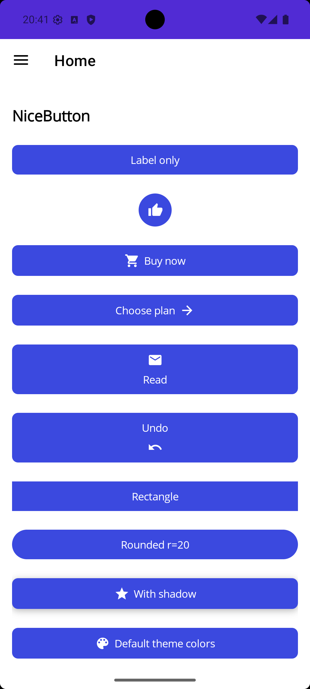
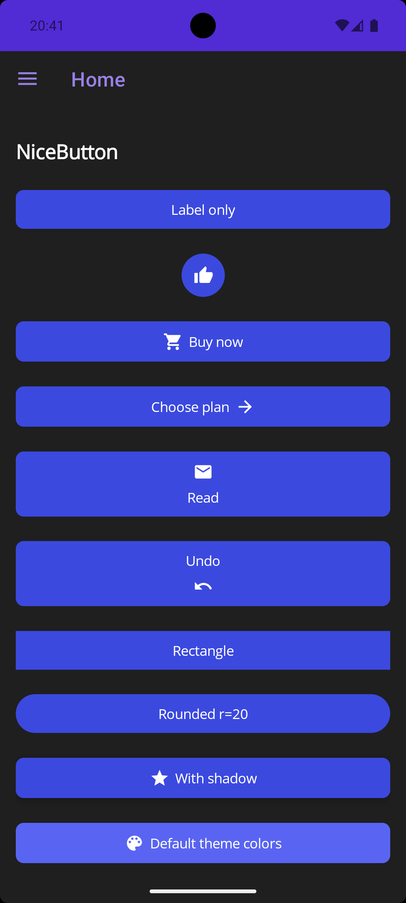

# NiceEntry

Labeled input controls for .NET MAUI with built-in validation, required field indicators, and light/dark theme support.


## Features

- **LabeledEntry** — Text input with floating label
- **LabeledPicker** — Dropdown picker with label
- **LabeledDatePicker** — Date selector with label
- **LabeledTimePicker** — Time selector with label
- **LabeledAutoCompleteEntry** — Entry with inline suggestion dropdown (new in 1.5)
- **NiceButton** — Standalone tappable icon/text button with shapes, shadow, and command binding
- Built-in validation error display (red border + error messages)
- Required field indicator (`*`)
- Unit suffix label with customizable font, size, and color
- Configurable content padding
- Example/hint text below the control
- Platform-specific native styling (Android & iOS)
- Light and dark theme support

## Platforms

| Platform | Minimum Version |
|----------|----------------|
| Android  | 21+            |
| iOS      | 15+            |

## Installation

Get the package from [NuGet](https://www.nuget.org/packages/NiceEntry/):

```bash
dotnet add package NiceEntry
```

## Usage

Add the namespace to your XAML:

```xml
xmlns:nice="clr-namespace:NiceEntry;assembly=NiceEntry"
```

### Basic entry

```xml
<nice:LabeledEntry Label="Name"
                   Text="{Binding Name}"
                   Placeholder="Enter your name"
                   IsRequired="True" />
```

### Entry with unit suffix

```xml
<nice:LabeledEntry Label="Battery size"
                   Text="{Binding BatterySize}"
                   Unit="kWh"
                   Keyboard="Numeric" />
```

### Custom unit styling

```xml
<nice:LabeledEntry Label="Weight"
                   Text="{Binding Weight}"
                   Unit="kg"
                   UnitFontSize="20"
                   UnitFontFamily="Georgia"
                   UnitColor="DarkOrange" />
```

### Custom padding

```xml
<nice:LabeledEntry Label="Extra padding"
                   Text="{Binding Value}"
                   ContentPadding="24,20" />
```

### Validation errors

Bind `Error` to an `IReadOnlyCollection<string>` — when non-empty, the border turns red and messages display below the control:

```xml
<nice:LabeledEntry Label="Email"
                   Text="{Binding Email}"
                   Error="{Binding EmailErrors}" />
```

### Picker

```xml
<nice:LabeledPicker Label="Country"
                    ItemsSource="{Binding Countries}"
                    SelectedItem="{Binding SelectedCountry}" />
```

### Date and time pickers

`Date` and `Time` are nullable — the field renders empty until a value is picked
(or set from the view model). Set `ShowClearButton="True"` to show a ✕ that resets
the value to `null`.

```xml
<nice:LabeledDatePicker Label="Select a date"
                        Date="{Binding SelectedDate}"
                        ShowClearButton="True" />

<nice:LabeledTimePicker Label="Select a time"
                        Time="{Binding SelectedTime}"
                        IsRequired="True" />
```

> **Breaking change (2.0):** `LabeledDatePicker.Date` is now `DateTime?` (default `null`,
> previously `DateTime.Today`) and `LabeledTimePicker.Time` is now `TimeSpan?` (default
> `null`). Bind to nullable view-model properties, and set an initial value
> (e.g. `Date = DateTime.Today`) to keep the previous behavior.

Platform notes:

- **Android:** the value commits when the user taps OK; Cancel keeps the field empty.
- **iOS:** the displayed value commits when the picker closes (Done), even if the user
  didn't scroll — opened means selected.
- A time picker opened from the empty state starts at 00:00 (MAUI default).

### Auto-complete entry

Filter a list of suggestions as the user types. Tap a row to commit it back into the entry.

```xml
<nice:LabeledAutoCompleteEntry Label="ICAO code"
                               Placeholder="e.g. ESGG"
                               Text="{Binding IcaoText}"
                               Suggestions="{Binding IcaoSuggestions}"
                               MaxSuggestions="6"
                               CommitOnUpperCase="True" />
```

| Property | Type | Description |
|----------|------|-------------|
| `Suggestions` | `IEnumerable` | Source list filtered against `Text` |
| `MaxSuggestions` | `int` | Cap on visible rows (default `8`; negative = unbounded) |
| `CommitOnUpperCase` | `bool` | Auto-uppercase typed text (useful for codes) |
| `SuggestionTemplate` | `DataTemplate` | Custom row template (default: single `Label`) |

## Common Properties (LabelBase)

| Property | Type | Description |
|----------|------|-------------|
| `Label` | `string` | Floating label text |
| `IsRequired` | `bool` | Shows a red `*` indicator |
| `Error` | `IReadOnlyCollection<string>` | Validation error messages |
| `Unit` | `string` | Unit suffix (e.g. "kWh", "kg") |
| `UnitFontSize` | `double` | Font size for the unit label |
| `UnitFontFamily` | `string` | Font family for the unit label |
| `UnitColor` | `Color` | Text color for the unit label |
| `ContentPadding` | `Thickness` | Inner padding (default: 12,10 Android / 12,12 iOS) |
| `Example` | `string` | Hint text displayed below the control |

## LabeledEntry Properties

| Property | Type | Description |
|----------|------|-------------|
| `Text` | `string` | Input text (two-way binding) |
| `Placeholder` | `string` | Placeholder text |
| `PlaceholderColor` | `Color` | Placeholder text color |
| `Keyboard` | `Keyboard` | Keyboard type (Default, Numeric, Email, etc.) |
| `MaxLength` | `int` | Maximum input length |
| `IsPassword` | `bool` | Mask input as password |
| `IsReadOnly` | `bool` | Prevent editing |
| `ReturnType` | `ReturnType` | Return key type |
| `ReturnCommand` | `ICommand` | Command on return key press |
| `HorizontalTextAlignment` | `TextAlignment` | Text alignment |
| `FontSize` | `double` | Input text font size |
| `SelectAllOnFocus` | `bool` | Select all text when the entry gains focus (default `true`) |

## NiceButton

`NiceButton` is a standalone tappable button that combines an optional icon (from Material Design Icons) with optional text. It is not part of the labeled-input family — it has no floating label or validation display.

The same buttons in light and dark mode — icon/text layouts, circle/rounded/rectangle shapes, shadow, and theme-aware colors:

<p align="center">
  
  &nbsp;&nbsp;
  
</p>

### Setup

`NiceButton` uses the Material Design Icons font, which must be registered before glyphs render correctly. Call `.UseNiceEntry()` in your `MauiProgram.cs`:

```csharp
builder.UseMauiApp<App>()
       .UseNiceEntry();   // registers the Material Design Icons font
```

Without this call, `Icon` glyphs render as empty boxes.

### Basic example

```xml
<nice:NiceButton Text="Buy now"
                 Icon="Cart"
                 BackgroundColor="#3B49DF"
                 TextColor="White"
                 Command="{Binding BuyCommand}" />
```

### Properties

| Category | Property | Type | Default |
|----------|----------|------|---------|
| Content | `Text` | `string` | `""` |
| Content | `Icon` | `MaterialIcon?` | `null` |
| Layout | `Orientation` | `ButtonContentOrientation` | `Horizontal` |
| Layout | `IconPlacement` | `IconPlacement` | `Start` |
| Layout | `Spacing` | `double` | `6` |
| Layout | `ContentPadding` | `Thickness` | iOS `(12,12)` / Android `(12,10)` |
| Shape | `ButtonShape` | `ButtonShape` | `Rounded` |
| Shape | `CornerRadius` | `double` | `8` |
| Color | `BackgroundColor` | `Color` | theme |
| Color | `Background` | `Brush` | – |
| Color | `TextColor` | `Color` | theme (icon + text) |
| Color | `DisabledBackgroundColor` | `Color` | `null` (built-in theme) |
| Color | `DisabledTextColor` | `Color` | `null` (built-in theme) |
| Color | `BorderColor` | `Color` | transparent |
| Color | `BorderWidth` | `double` | `0` |
| Text | `FontSize` | `double` | `NiceButton.DefaultFontSize` (14.0) |
| Text | `FontFamily` | `string` | – |
| Text | `FontAttributes` | `FontAttributes` | `None` |
| Text | `LineBreakMode` | `LineBreakMode?` | `null` (auto: `WordWrap` for Vertical, `TailTruncation` for Horizontal) |
| Icon | `IconSize` | `double` | `20` |
| Shadow | `HasShadow` | `bool` | `false` |
| Shadow | `CustomShadow` | `Shadow` | – |
| Interaction | `Command` | `ICommand` | – |
| Interaction | `CommandParameter` | `object` | – |
| Interaction | `IsEnabled` | `bool` | `true` (inherited) |

### Disabled state

When `IsEnabled="False"` (or `Command.CanExecute` returns `false`) the button switches to muted colors automatically. The built-in theme values meet a contrast ratio of ~3.5:1 (light) and ~5:1 (dark) so disabled text remains legible.

Override them when you need to match your app's own palette:

```xml
<nice:NiceButton IsEnabled="False"
                 DisabledBackgroundColor="#EEEEEE"
                 DisabledTextColor="{AppThemeBinding Light=#616161, Dark=#BDBDBD}"
                 ... />
```

`null` (the default) means "use the built-in themed colors."

The disabled colors are applied directly to the button's internal labels and are protected from being overridden by your app's implicit `Label` style: `NiceButton` installs its own (empty) `CommonStates` visual-state group on those labels, so a stock template's `Disabled` visual state can't recolor them behind your back. You don't need to do anything for this to work.

### Enums and constants

- **`ButtonShape`** — `Rectangle`, `Rounded`, `Circle`
- **`ButtonContentOrientation`** — `Horizontal`, `Vertical` (set via the `Orientation` property)
- **`IconPlacement`** — `Start`, `End`
- **`MaterialIcon`** — generated enum with codepoint values for every MDI glyph
- **`NiceButton.DefaultFontSize`** — constant `14.0`

### Icon source

Icons come from [Material Design Icons](https://pictogrammers.com/library/mdi). Browse the library to find an icon name, then pass it as the `Icon` property value using the `MaterialIcon` enum (e.g. `Icon="Cart"`, `Icon="Account"`, `Icon="ArrowRight"`).

## Third-party licenses

NiceEntry bundles the [Material Design Icons](https://pictogrammers.com/library/mdi/) webfont
(v7.4.47, from [Templarian/MaterialDesign-Webfont](https://github.com/Templarian/MaterialDesign-Webfont))
as an embedded resource used by `NiceButton` to render icons.

The font is distributed under the **Apache License, Version 2.0** by the
[Pictogrammers](https://pictogrammers.com/) icon group.
Full license text and required attribution notices are in [THIRD-PARTY-NOTICES.md](THIRD-PARTY-NOTICES.md).

## License

[MIT](LICENSE)
