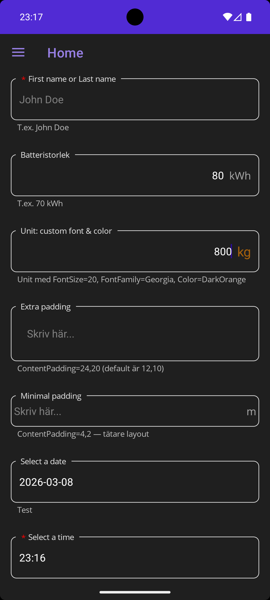

# NiceEntry

Labeled input controls for .NET MAUI with built-in validation, required field indicators, and light/dark theme support.



## Features

- **LabeledEntry** — Text input with floating label
- **LabeledPicker** — Dropdown picker with label
- **LabeledDatePicker** — Date selector with label
- **LabeledTimePicker** — Time selector with label
- **LabeledAutoCompleteEntry** — Entry with inline suggestion dropdown (new in 1.5)
- Built-in validation error display (red border + error messages)
- Required field indicator (`*`)
- Unit suffix label with customizable font, size, and color
- Configurable content padding
- Example/hint text below the control
- Platform-specific native styling (Android & iOS)
- Light and dark theme support

## Platforms

| Platform | Minimum Version |
|----------|----------------|
| Android  | 21+            |
| iOS      | 15+            |

## Installation

```bash
dotnet add package NiceEntry
```

## Usage

Add the namespace to your XAML:

```xml
xmlns:nice="clr-namespace:NiceEntry;assembly=NiceEntry"
```

### Basic entry

```xml
<nice:LabeledEntry Label="Name"
                   Text="{Binding Name}"
                   Placeholder="Enter your name"
                   IsRequired="True" />
```

### Entry with unit suffix

```xml
<nice:LabeledEntry Label="Battery size"
                   Text="{Binding BatterySize}"
                   Unit="kWh"
                   Keyboard="Numeric" />
```

### Custom unit styling

```xml
<nice:LabeledEntry Label="Weight"
                   Text="{Binding Weight}"
                   Unit="kg"
                   UnitFontSize="20"
                   UnitFontFamily="Georgia"
                   UnitColor="DarkOrange" />
```

### Custom padding

```xml
<nice:LabeledEntry Label="Extra padding"
                   Text="{Binding Value}"
                   ContentPadding="24,20" />
```

### Validation errors

Bind `Error` to an `IReadOnlyCollection<string>` — when non-empty, the border turns red and messages display below the control:

```xml
<nice:LabeledEntry Label="Email"
                   Text="{Binding Email}"
                   Error="{Binding EmailErrors}" />
```

### Picker

```xml
<nice:LabeledPicker Label="Country"
                    ItemsSource="{Binding Countries}"
                    SelectedItem="{Binding SelectedCountry}" />
```

### Date and time pickers

```xml
<nice:LabeledDatePicker Label="Select a date"
                        Date="{Binding SelectedDate}" />

<nice:LabeledTimePicker Label="Select a time"
                        Time="{Binding SelectedTime}"
                        IsRequired="True" />
```

### Auto-complete entry

Filter a list of suggestions as the user types. Tap a row to commit it back into the entry.

```xml
<nice:LabeledAutoCompleteEntry Label="ICAO code"
                               Placeholder="e.g. ESGG"
                               Text="{Binding IcaoText}"
                               Suggestions="{Binding IcaoSuggestions}"
                               MaxSuggestions="6"
                               CommitOnUpperCase="True" />
```

| Property | Type | Description |
|----------|------|-------------|
| `Suggestions` | `IEnumerable` | Source list filtered against `Text` |
| `MaxSuggestions` | `int` | Cap on visible rows (default `8`; negative = unbounded) |
| `CommitOnUpperCase` | `bool` | Auto-uppercase typed text (useful for codes) |
| `SuggestionTemplate` | `DataTemplate` | Custom row template (default: single `Label`) |

## Common Properties (LabelBase)

| Property | Type | Description |
|----------|------|-------------|
| `Label` | `string` | Floating label text |
| `IsRequired` | `bool` | Shows a red `*` indicator |
| `Error` | `IReadOnlyCollection<string>` | Validation error messages |
| `Unit` | `string` | Unit suffix (e.g. "kWh", "kg") |
| `UnitFontSize` | `double` | Font size for the unit label |
| `UnitFontFamily` | `string` | Font family for the unit label |
| `UnitColor` | `Color` | Text color for the unit label |
| `ContentPadding` | `Thickness` | Inner padding (default: 12,10 Android / 12,12 iOS) |
| `Example` | `string` | Hint text displayed below the control |

## LabeledEntry Properties

| Property | Type | Description |
|----------|------|-------------|
| `Text` | `string` | Input text (two-way binding) |
| `Placeholder` | `string` | Placeholder text |
| `PlaceholderColor` | `Color` | Placeholder text color |
| `Keyboard` | `Keyboard` | Keyboard type (Default, Numeric, Email, etc.) |
| `MaxLength` | `int` | Maximum input length |
| `IsPassword` | `bool` | Mask input as password |
| `IsReadOnly` | `bool` | Prevent editing |
| `ReturnType` | `ReturnType` | Return key type |
| `ReturnCommand` | `ICommand` | Command on return key press |
| `HorizontalTextAlignment` | `TextAlignment` | Text alignment |
| `FontSize` | `double` | Input text font size |

## License

[MIT](LICENSE)
